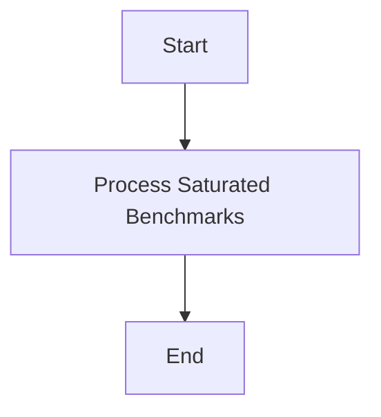

# Saturated Benchmarks

This is a detailed page about Saturated Benchmarks.

```mermaid
graph TD
    A[Start] --> B[Process Saturated Benchmarks]
    B --> C[End]
```

[Back to README](../README.md)
